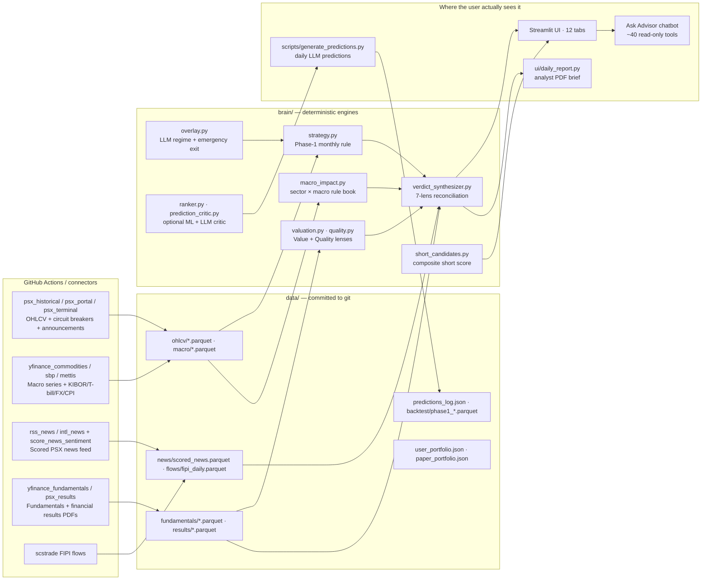

# PSX Trading Bot — Plan D

An evidence-based, low-turnover monthly momentum strategy for the Pakistan
Stock Exchange (PSX), wrapped in a 12-tab analyst dashboard, sitting under
a **Master Strategist top layer** — Claude Sonnet 4.5 with extended-thinking
reasoning across every signal the bot has — that publishes one auditable
top-of-stack call per day.

The codebase implements **exactly the kind of system the published research
on PSX recommends**: deterministic rules-first (because PSX is weak-form
inefficient and adaptive, not efficient), with explicit fundamental,
technical, macro, news, flow, and management lenses reconciled into one
auditable verdict per stock. On top of that, Claude reads the entire
briefing — the mechanical Phase-1 signal, the 7-lens verdicts, the macro
impact engine, FIPI flows, news sentiment, predictions log, earnings
calendar, material information, and the user's own portfolio — and tells
you what to do, with citations to the contributing signals and an explicit
flag whenever it overrides the mechanical rule.

This is **version 2**. The original ML-heavy design (per-stock LightGBM +
CatBoost + 70-feature daily 5-day direction classifier) was audited
end-to-end and shown to be net-of-cost unprofitable — see
`psx_strategy_v2.md` for the forensic report. The v2 system is
deterministic, rule-based, and simple enough to reason about line by line.

It trades a **curated 35-stock KSE-100-mirroring universe** (expanded from
the original 15-stock set on 2026-04-30). Two layers:

- **7 user-required tickers** pinned in `config/candidates.py::REQUIRED_TICKERS`
  — currently `HUBC, PABC, MLCF, OGDC, FABL, PPL, NPL`.
- **28 flex slots** chosen to span the live KSE-100 sector composition
  (Banking ~22%, Cement ~14%, Oil & Gas E&P ~12%, Power ~11%, Fertilizer ~9%,
  OMC/Refining ~9%, Conglomerate/Chem ~9%, Technology ~6%, Pharma/Consumer/
  Auto/Misc ~12%). Regenerate quarterly with
  `python scripts/select_universe.py`.

## Strategy in one paragraph

On the **last trading day of every month**, rank the 35-stock universe by
150-day log-return, drop the most volatile 30% (by 20-day realized vol),
and if the universe's average 150-day momentum is positive, hold the top 5
equal-weighted for the month. If universe momentum is negative — **go to
cash**. An optional LLM overlay scales exposure down in CAUTION / CRISIS
macro regimes and triggers emergency exits on severe company-specific news.
That's it.

The mechanical strategy is the **trading core**. Layered on top is a
deterministic 7-lens analyst stack (Value / Quality / Momentum / Macro /
News / Flow / Management) that produces ONE reconciled verdict per stock
for the dashboard, the daily PDF brief, the chatbot, and a parallel
short-side scorer.

Sitting on top of all of that is the **Master Strategist** — see
`brain/master_strategist.py`. Claude Sonnet 4.5, in extended-thinking
mode (12k token internal reasoning budget), reads the full briefing and
publishes a single JSON decision with: a one-line headline, a risk-stance
bucket (`AGGRESSIVE / NORMAL / CAUTIOUS / DEFENSIVE / CASH`), conviction
(`LOW / MEDIUM / HIGH`), a 3-6 sentence narrative, a macro lens, a
behavioural lens (PSX is well-documented as emotion-driven and herding-
prone — this paragraph reads it explicitly), a list of concrete actions
with `target_weight_pct`, and — critically — a `contributing_signals`
array on every action that names which underlying signals justified it.
The strategist is allowed to override Phase-1, but only with the
override flagged and the reason spelled out.

## What it does each trading day

1. Pulls fresh EOD prices (PSX DPS) + macro series (yfinance).
2. Marks open positions to market, updates equity curve.
3. If today is the last trading day of the month → **monthly rebalance**
   (pick top-5, LLM regime multiplier, emit orders).
4. Otherwise → **daily maintenance** (per-position news check, trailing stop
   if enabled, report generation).
5. Writes a Markdown report to `reports/YYYY-MM-DD.md`.

Monthly rebalance is the only time the bot trades. Daily runs are mostly
inspection + paper P&L updates. Expected turnover is ~15-25 trades/year.

## Architecture



## Project layout

```
pakistan stock market/
├── config/
│   ├── universe.py                 # The 35 stocks the bot trades
│   ├── candidates.py               # REQUIRED_TICKERS + CANDIDATE_POOL
│   ├── costs.py                    # PSX round-trip cost model
│   ├── short_eligibility.py        # Conservative short-side eligibility
│   ├── sbp_mpc_calendar.py         # Known + estimated MPC dates
│   └── data_slas.py                # Per-feed freshness SLAs
├── connectors/                     # 17 data-source connectors (BaseConnector)
│   ├── psx_historical.py           # PSX DPS EOD time-series
│   ├── psx_portal.py               # Circuit breakers, announcements,
│   │                               #   indices, MarketWatch
│   ├── psx_results.py              # Financial results PDFs
│   ├── psx_terminal.py             # Real-time PSX terminal feed
│   ├── sbp.py                      # SBP policy rate + KIBOR + T-bill
│   ├── mettis_global.py            # Mettis market data
│   ├── flows.py                    # FIPI / LIPI flows (SCStrade)
│   ├── yfinance_commodities.py     # Brent / coal / cotton / gold
│   ├── yfinance_fundamentals.py    # Per-stock fundamentals
│   ├── rss_news.py / intl_news.py  # PSX + global news
│   └── ...
├── data/                           # All committed to git (audit trail)
│   ├── ohlcv/                      # Per-symbol Parquet (5y daily bars)
│   ├── macro/                      # yfinance + SBP macro series
│   ├── news/                       # Scored news feed
│   ├── fundamentals/               # Per-stock fundamentals snapshots
│   ├── results/                    # Financial-results extracts
│   ├── flows/fipi_daily.parquet    # Daily FIPI cache
│   ├── backtest/                   # Phase-1 walk-forward outputs
│   ├── _health/                    # Per-feed freshness JSON + history
│   ├── predictions_log.json        # Append-only LLM predictions + actuals
│   ├── user_portfolio.json         # User's real holdings
│   ├── paper_portfolio.json        # Bot's virtual book
│   ├── _strategist/                # One JSON per day from brain/master_strategist.py
│   ├── playbook/cases.json         # Curated 'situation -> reaction' case library
│   ├── playbook/_events.json       # Active in-window external events (IMF, elections, ...)
│   ├── flows/mutual_fund_holdings.parquet  # Per (month, fund, symbol) AHL MF holdings
│   ├── flows/mf_top_holdings_summary.parquet # Per (month, symbol) summary w/ MoM column
│   └── raw/mf_holdings/*.pdf       # Source AHL Mutual Funds Equity Holdings PDFs
├── brain/
│   ├── master_strategist.py        # ⭐ Top-of-stack Claude (reads EVERY signal)
│   ├── playbook.py                 # Curated 'situation -> reaction' case library matcher
│   ├── mf_flows.py                 # Mutual-fund "smart money" flow signals (AHL data)
│   ├── strategy.py                 # Deterministic monthly momentum rule
│   ├── overlay.py                  # LLM defensive overlay (regime + exits)
│   ├── macro_impact.py             # Sector × macro rule book + amplifier
│   ├── valuation.py                # Sector-aware fair value
│   ├── quality.py                  # 0-100 quality + earnings-momentum
│   ├── sector_ratios.py            # Sector medians for ratio context
│   ├── earnings_calendar.py        # Predicted earnings + 5d blackout
│   ├── verdict_synthesizer.py      # 7-lens reconciliation per stock
│   ├── short_candidates.py         # Composite short score + guards
│   ├── prediction_critic.py        # Post-LLM consistency checks
│   ├── buy_explainer.py            # Auditable buy-side rationale
│   ├── ranker.py                   # Phase-2 cross-sectional LightGBM (gated)
│   ├── features.py                 # Momentum + volatility helpers
│   ├── backtest_v2.py              # Honest end-to-end backtest
│   ├── paper_portfolio.py          # Paper-trading portfolio
│   └── _legacy/                    # Archived v1 ML stack (not imported)
├── ui/                             # Streamlit UI (12 tabs)
│   ├── app.py                      # Entry point: streamlit run streamlit_app.py
│   ├── tools.py                    # ~40 read-only tools (chatbot truth layer)
│   ├── llm_clients.py              # Claude + Gemini + GitHub Models loops
│   ├── dashboard_data.py           # Today-tab aggregator
│   ├── daily_report.py             # PDF brief generator (16 sections)
│   ├── system_health.py            # Data freshness + workflow status
│   ├── short_ideas.py              # Bearish picks tab
│   ├── phase1_backtest.py          # Strategy-tester panel
│   ├── recommendations.py          # Position analysis + scanner
│   ├── portfolio.py / watchlist.py / trade_journal.py
│   ├── overnight.py                # Overnight global-risk prior
│   ├── news_sentiment.py / explainers.py
│   └── __init__.py
├── scripts/
│   ├── select_universe.py          # Quarterly universe refresh
│   ├── backfill.py                 # Pull 5y OHLCV for universe
│   ├── refresh_*.py                # Per-feed refresh jobs (called by Actions)
│   ├── score_news_sentiment.py     # Batch-score RSS via Claude Haiku
│   ├── generate_predictions.py     # Daily LLM predictions
│   ├── check_predictions.py        # Scorecard vs realised 5d returns
│   ├── extract_director_report.py  # PSX directors-report PDF parser
│   ├── ingest_ahl_mf_holdings.py   # AHL Mutual Funds Equity Holdings PDF ingestion
│   ├── ingest_macro_history.py     # 5-year backfill: SBP rate, KIBOR, T-bills, CPI, FX, KSE-100, FIPI
│   ├── audit_production_config.py  # Live-config audit + grid search
│   ├── audit_low_turnover.py       # Broader rule grid
│   ├── audit_deep.py               # Stability + monkey-test
│   ├── validate_ranker.py          # Phase-2 deployment-gate
│   ├── phase1_backtest.py          # Walk-forward harness for the UI panel
│   ├── replay_briefing.py          # Reconstruct the strategist briefing for any historical date
│   ├── historical_test_playbook.py # 3-mode (baseline / +macro / +MF) playbook regression test
│   ├── health_check.py             # Per-feed SLA enforcement
│   └── _legacy/                    # Archived v1 scripts
├── .github/workflows/              # 14 GitHub Actions (13 scheduled + 1 path-triggered)
│   ├── eod.yml                     # 16:30 PKT — OHLCV + FIPI + scorecard
│   ├── predictions.yml             # 09:20 PKT — per-ticker 5-day forecasts
│   ├── master_strategist.yml       # 09:30 PKT — Claude top-of-stack call
│   ├── validate_playbook.yml       # On push/PR touching data/playbook/**
│   ├── overnight.yml               # 09:00 PKT — overnight globals
│   ├── news_scoring.yml            # 3x/day — score RSS news
│   ├── macro_series.yml / macro_kpis.yml
│   ├── fundamentals.yml / financial_results.yml / material_info.yml
│   ├── ingest_mf_holdings.yml      # 5th of each month 09:00 PKT — pull AHL MF Holdings
│   ├── intraday_session.yml
│   └── health_check.yml            # Pre-open SLA gate
├── psx_strategy_v2.md              # Plan D design doc + audit findings
├── Pakistan Stock Market Research Factors.docx  # Behavioral/macro research
└── README.md                       # This file
```

## Quick start

```powershell
# 1. Install deps
python -m venv .venv
.venv\Scripts\Activate.ps1
pip install -r requirements.txt

# 2. (Optional) Select the 9 flex-slot tickers by training-AUC rank.
#    Only needed if you changed REQUIRED_TICKERS or CANDIDATE_POOL.
python scripts\select_universe.py

# 3. Backfill 5 years of data (one-time, ~1 min)
python scripts\backfill.py
python scripts\backfill_macro.py

# 4. Run the honest backtest (shows the edge this system has)
python -m brain.backtest_v2                       # no LLM overlay
python -m brain.backtest_v2 --with-overlay        # with rule-based overlay

# 5. Generate today's report (safe first run)
python scripts\generate_report_v2.py --dry-run

# 6. Schedule the daily pipeline (see "Scheduling" below)
python scripts\daily_pipeline.py

# 7. Launch the interactive UI (chatbot + portfolio + scanner)
streamlit run ui\app.py

# 8. Generate & track daily predictions for your 6 required tickers
#    (rule-based if no API key; set ANTHROPIC_API_KEY or GOOGLE_API_KEY
#    for the full LLM-with-news version)
python scripts\generate_predictions.py
python scripts\check_predictions.py
```

## The 7-lens analyst stack (`brain/verdict_synthesizer.py`)

Every stock the bot covers is independently scored by 7 lenses — each
producing a signed integer in `[-3, +3]` with a one-line reason — and
then **deterministically reconciled** into ONE verdict per stock with
explicit conflict-resolution rules.

| Lens | Module | What it answers |
|---|---|---|
| **Value** | `brain/valuation.py` | Sector-aware fair value (DDM for banks/utilities, P/B for E&Ps, 3-yr-avg P/E for cement, blends elsewhere) → BUY_VALUE / FAIR / SELL_VALUE |
| **Quality** | `brain/quality.py` | 0-100 from ROE / leverage / earnings stability / revenue & EPS growth, sector-anchored for banks & utilities |
| **Momentum** | strategy + `brain/features.py` | RSI / MACD / OBV / 5d / 21d / 150d returns |
| **Macro** | `brain/macro_impact.py` | Sector tailwind/headwind from policy rate, Brent, USD/PKR, coal, cotton, gold, circular-debt — leverage-amplified per stock |
| **News** | `ui/news_sentiment.py` | Scored news with confidence, ticker-tagged |
| **Flow** | `connectors/flows.py` + tools | FIPI / LIPI institutional positioning ("smart money" signal flagged in PSX research) |
| **Management** | `extract_director_report.py` | Director's-report tone + growth plans |

Output:

```python
Verdict(
    symbol="HUBC", sector="Power",
    action="BUY", direction="BULLISH", conviction="HIGH", score=11,
    contributions=[LensContribution("Value", +2, "DDM upside +18%"), ...],
    conflicts=["Macro is bullish but news is bearish — net positive"],
    resolution_log=["Weighted technicals + flow heavily for 5d call", ...],
)
```

This solves the classic "Value says SELL, Momentum says BUY — what do I
do?" problem with **one call the analyst can defend**, even if the LLM
strategist is unavailable.

## Short-side scoring (`brain/short_candidates.py`)

A composite 0-100 `short_score` that mirrors the bullish pipeline:

| Bucket | Max | Source |
|---|---|---|
| Verdict synthesizer (bearish lens lean) | 30 | `brain/verdict_synthesizer.py` |
| 5-day prediction expected return (if BEARISH) | 25 | `data/predictions_log.json` |
| News sentiment over trailing 7 days | 15 | `data/news/scored_news.parquet` |
| Technical breakdown + intraday relative weakness | 15 | `connectors/psx_terminal.py` |
| Macro headwind + industry KPI weakness | 10 | `brain/macro_impact.py` |
| Intraday lower-circuit hit in last 5 sessions | 5 | `connectors/psx_portal.py` |

With **pre-event guards** (earnings within 5d → cap conviction at MEDIUM;
SBP MPC within 7d for rate-sensitive sectors → cap at MEDIUM) and a
**regime adjustment** (downgrade shorts one notch when KSE-100 is in a
clean uptrend — flagging the most common retail mistake). A
concentration cap mirrors the long side: 3+ candidates in the same
sector → lowest-scoring is downgraded with `concentration_warning`.

## Daily predictions + scorecard

`generate_predictions.py` produces a dated 5-trading-day forecast for every
ticker in `REQUIRED_TICKERS` (HUBC, PABC, MLCF, OGDC, FABL, PPL by default).
Each record captures a full data snapshot so the prediction can be honestly
scored later, regardless of model drift. Output:
`data/predictions_log.json` (append-only, keyed by `YYYY-MM-DD-SYMBOL`).

Each prediction contains:

| Field                         | Meaning |
|-------------------------------|---------|
| `direction`                   | BULLISH / NEUTRAL / BEARISH |
| `conviction`                  | LOW / MEDIUM / HIGH |
| `expected_return_5d_*_pct`    | Low / mid / high of the expected range |
| `suggested_action`            | BUY / ADD / HOLD / TRIM / AVOID / SELL |
| `suggested_stop_pkr`          | Level that invalidates the view |
| `suggested_target_pkr`        | Next resistance given the setup |
| `key_drivers` / `key_risks`   | Bullet list grounded in the data |
| `data_snapshot`               | Full numeric state at prediction time (price, 4 momentum horizons, vol regime, RSI, trend, FIPI, policy rate, Brent, USD/PKR, news headlines) |
| `outcome`                     | Filled by `check_predictions.py` after horizon elapses |

`check_predictions.py` walks the log, fills `outcome.actual_return_pct` for
any prediction whose horizon has passed, flags `direction_hit`,
`inside_range`, `stop_triggered`, `target_triggered`, then prints a
scorecard broken down by conviction and by symbol. Run it once a day after
close and the hit rate becomes visible after the first full week.

### Models

| `--model`  | Data used | Quality |
|------------|-----------|---------|
| `rule`     | Momentum (4 horizons), vol, RSI, SMA trend, FIPI, policy rate, Brent for E&P | Fast, deterministic, no news semantics |
| `claude`   | All of the above + news headlines, sector flows, macro narrative | Uses `claude-sonnet-4-5` with a small extended-thinking budget (override via `PSX_PREDICT_MODEL` / `PSX_PREDICT_THINKING_BUDGET=0`); requires `ANTHROPIC_API_KEY` |
| `gemini`   | Same as Claude | Uses `gemini-2.5-flash`, requires `GOOGLE_API_KEY` |
| `auto`     | Picks Claude > Gemini > rule based on which keys are set | Default |

Every prediction is also **fact-checked by `brain/prediction_critic.py`**
before it's written to disk — a small set of deterministic post-LLM checks
that catch internally inconsistent calls (e.g. `direction=BULLISH,
conviction=HIGH` with `key_drivers=["RSI 28 oversold", "5d return -8%"]`).
Severity escalates from `info` → `warn` (downgrade conviction) → `fail`
(force HOLD, conviction LOW), with the trigger reason stamped into a
`critic_notes` field so the analyst can see exactly what was caught.

```powershell
$env:ANTHROPIC_API_KEY = "sk-ant-..."
python scripts\generate_predictions.py         # auto → Claude
python scripts\generate_predictions.py --symbols LUCK MCB   # ad-hoc
python scripts\check_predictions.py             # fills outcomes + prints scorecard
python scripts\check_predictions.py --force     # re-score everything
```

## Overnight global-risk prior (gap-direction model)

Every prediction briefing now opens with an **overnight global risk block**
pulled from `data/macro/overnight_global.parquet` (S&P 500, VIX, Nikkei,
Hang Seng, FTSE, DXY, EM ETF) plus a **data-fitted gap prior**.

The weights in `ui/overnight.py::FITTED_WEIGHTS` come from ridge regression
on 2 years of PSX universe-median overnight gaps (see
`scripts/fit_overnight_weights.py`). Key numbers:

| Signal        | Fitted β | Correlation w/ next-day PSX gap |
|---------------|---------:|---:|
| S&P 500 1d    |  +0.080  | +0.18 |
| EEM (EM) 1d   |  +0.039  | +0.16 |
| Nikkei 1d     |  -0.019  | -0.12 (contrarian) |
| Hang Seng 1d  |  -0.007  | -0.05 (noise) |
| DXY 1d        |  -0.013  | -0.01 |
| VIX dev       |  -0.004  | -0.06 |
| **intercept** |  **+0.34** | — |

**Out-of-sample (Mar-Apr 2026, 33 days):** 51.5% 3-class direction hit vs
27.3% for zero baseline. R² = 0.045. It's a weak tilt, not a forecast.

**Keep the overnight cache fresh:**

```powershell
python scripts\fetch_overnight_global.py   # re-pull 2y; run daily
python scripts\fit_overnight_weights.py    # re-fit when you have ~30 days more data
python scripts\backtest_overnight_prior.py # sanity-check the prior across the window
```

## Daily FIPI cache (build history forward)

`data/flows/fipi_daily.parquet` stores daily SCStrade FIPI snapshots so we
can eventually fit FIPI into the overnight model. SCStrade has no historical
archive and NCCPL blocks scrapers, so this cache **grows forward** one row
per run.

```powershell
python scripts\cache_fipi_daily.py    # append today (run after ~16:00 PKT)
```

Recommended: schedule with Task Scheduler to run `cache_fipi_daily.py`
every weekday around 16:30 PKT. Once you have ≥30 days of history, re-run
`fit_overnight_weights.py` with FIPI added as a feature and the prior
should tighten further.


## Transaction cost model

`config/costs.py` models PSX round-trip costs so every trade plan is
scored on NET returns (not gross):

  Brokerage 0.30% + CDC/PSX/SECP 0.013% + FED 0.048% + slippage 0.20%
  = ~0.56% round-trip, plus 15% CGT on gains (filer, <1y hold)

A BUY/ADD call must clear `cost + 1.0%` minimum edge (≈1.6% gross) or
it falls into the *"LLM-BUY-BUT-SUB-EDGE"* bucket in
`scripts/todays_buys.py` and is skipped. The live prompt in
`generate_predictions.py` also tells Claude to downgrade to HOLD when
expected 5d mid < 1.6%. The scorecard (`check_predictions.py`) now
reports both gross and NET direction hit rate + average return.

```powershell
python config\costs.py          # show the model
python scripts\todays_buys.py   # see gross / cost / net columns
```


## Scored news sentiment

`scripts/score_news_sentiment.py` batches RSS headlines through Claude
Haiku and scores each one for PSX impact (sentiment in [-1, +1],
confidence, category, affected tickers). Writes to
`data/news/scored_news.parquet`, dedup by hashed article link.

```powershell
python scripts\score_news_sentiment.py                # default: 5/feed, batch 8
python scripts\score_news_sentiment.py --per-feed 10  # pull more per feed
python scripts\score_news_sentiment.py --rescore      # re-score everything
```

`ui/news_sentiment.py` aggregates the cache into:
- `macro_sentiment(hours)` — weighted macro/policy tilt
- `ticker_sentiment(sym, hours)` — per-symbol tilt
- `sentiment_block(...)` — plain-text block for LLM briefings

The macro tilt is automatically embedded in `build_overnight_block(...)`
(so walk-forward + live predictions both see it), and the full scored
block (including ticker-specific tilt) is appended to every per-symbol
prediction briefing in `generate_predictions.py`.

Recommended: schedule alongside `cache_fipi_daily.py` — run
`score_news_sentiment.py` 2-3x per day (morning, midday, close) to keep
the 24h macro tilt fresh.


## Deployment — GitHub Actions as your data janitor, Streamlit Cloud (free) for the UI

The daily data pipeline runs as **11 scheduled GitHub Actions workflows**
that fetch, score, and commit updated data back to the repo. Your
deployed Streamlit Cloud app (or local clone with `git pull`) sees fresh
data within minutes. No servers to manage, no cloud UI hosting cost.

The architectural choice that makes this fit on Streamlit Cloud's free
tier: the UI **never** trains a model on demand — it only reads
pre-computed parquets / JSON. That's why `requirements.txt` deliberately
leaves out `lightgbm`, `catboost`, `torch`, `transformers`, `vectorbt`,
and `shap`. Use `requirements-full.txt` if you also want to train models
or run the full backtest locally.

### Schedule (all times UTC; cron is `m h DOM MON DOW`, DOW 1-5 = Mon-Fri)

| Workflow | Cron | PKT time | What it does |
|----------|------|----------|--------------|
| `macro_series.yml`     | `55 1 * * 1-5`     | 06:55 | Refresh commodities + FX (Brent / coal / cotton / gold / USD/PKR) |
| `news_scoring.yml`     | `0 2,8,13 * * 1-5` | 07:00 / 13:00 / 18:00 | Batch-score fresh PSX + global news → `data/news/scored_news.parquet` |
| `macro_kpis.yml`       | `30 3 * * 1-5`     | 08:30 | Morning SBP / KIBOR / T-bill snapshot |
| `overnight.yml`        | `0 4 * * 1-5`      | 09:00 | S&P 500, VIX, Nikkei, HSI, FTSE, DXY, EEM closes |
| `health_check.yml`     | `10 4 * * 1-5`     | 09:10 | Pre-open SLA gate — fails the build if any feed is stale |
| `predictions.yml`      | `20 4 * * 1-5`     | 09:20 | Generate 5-day predictions for required tickers via Claude Sonnet 4.5 → `data/predictions_log.json` |
| `master_strategist.yml`| `30 4 * * 1-5`     | 09:30 | Top-of-stack Claude reasoning over **every** signal → `data/_strategist/<date>.json` + `latest.json` |
| `intraday_session.yml` | hourly during PKT session | 10:00–15:30 | Snapshot intraday session metrics |
| `material_info.yml`    | `30 11 * * 1-5`    | 16:30 | PSX material-information disclosures |
| `eod.yml`              | `30 11 * * 1-5`    | 16:30 | Refresh OHLCV + FIPI flows + score yesterday's predictions; auto-dispatches `financial_results.yml` on earnings days |
| `fundamentals.yml`     | weekly             | Mon AM | Refresh per-stock fundamentals snapshots |
| `financial_results.yml`| dispatched         | event-driven | Extract financial-results PDFs (triggered by `eod.yml`) |

### One-time setup (~10 minutes)

1. **Push this repo to GitHub** (private is strongly recommended — the
   strategy code and your trading picks are in here):

   ```powershell
   git init
   git add .
   git commit -m "init"
   git remote add origin https://github.com/<you>/psx-trading-bot.git
   git push -u origin main
   ```

2. **Add repo secrets** at *Settings → Secrets and variables → Actions*:
   - `ANTHROPIC_API_KEY` — required for predictions + news scoring
   - `GEMINI_API_KEY` — optional, only if you use the Gemini chat fallback
     in the local UI

3. **Enable Actions** at *Settings → Actions → General*:
   - Allow all actions
   - Under *Workflow permissions*, select **"Read and write permissions"**
     (so the jobs can commit data back). Also tick **"Allow GitHub Actions
     to create and approve pull requests"** just in case.

4. **Verify the first run** — go to the *Actions* tab, pick any workflow,
   click **"Run workflow"** to trigger it manually. Confirm it succeeds
   and that a commit like `data: overnight globals 2026-04-24` appears
   on main.

### Daily usage on your laptop

The dashboard is intentionally lightweight at runtime — the heavy ML
training (LightGBM / CatBoost / torch / transformers / vectorbt / shap)
runs in scheduled GitHub Actions, not at UI runtime, so the local
``requirements.txt`` is the slim Streamlit-Cloud-compatible one. Use
``requirements-full.txt`` if you also want to train models or run the
backtest locally.

```powershell
# 1. Clone once
git clone https://github.com/<you>/psx-trading-bot.git
cd psx-trading-bot
python -m venv .venv
.venv\Scripts\activate
# Slim runtime (UI + chatbot + connectors, ~150 MB):
pip install -r requirements.txt
# OR full stack (training + backtest, ~2 GB):
pip install -r requirements-full.txt

# 2. Create a local .env with your API keys (never commit this)
#    ANTHROPIC_API_KEY=...
#    GEMINI_API_KEY=...
#    GITHUB_TOKEN=ghp_...   (free chatbot via GitHub Models)

# 3. Launch the UI
streamlit run streamlit_app.py
# (legacy entry point still works: streamlit run ui\app.py)
```

### Hosting the UI on Streamlit Cloud (free tier)

The app is ready to deploy on [Streamlit Community Cloud](https://share.streamlit.io)
for free. The runtime image is well under the 1 GB memory ceiling
because the heavy training packages are kept in ``requirements-full.txt``,
which Streamlit Cloud does not install.

Deploy in three clicks:

1. **Sign in** to [share.streamlit.io](https://share.streamlit.io)
   with the same GitHub account that owns this repository.
2. Click **New app** and fill in:
    - *Repository*: ``<you>/psx-trading-bot``
    - *Branch*: ``main``
    - *Main file path*: ``streamlit_app.py``
    - *Python version*: ``3.11``
3. Open **Advanced settings → Secrets** and paste this TOML
   (using the values from your local ``.env``):

    ```toml
    ANTHROPIC_API_KEY = "sk-ant-api03-..."
    GITHUB_TOKEN      = "ghp_..."
    GEMINI_API_KEY    = "AIza..."
    ```

   The same template lives in ``.streamlit/secrets.toml.example`` for
   reference. Click **Deploy**.

The app re-deploys automatically on every push to ``main``, so once
the GitHub Actions workflows commit fresh data the live dashboard
sees it within a few minutes. There are no servers to manage and no
secrets in source control — Streamlit Cloud holds them in its own
encrypted store.

Then in the running Streamlit app, click **"Pull latest data from GitHub"**
in the sidebar whenever you want a fresh snapshot — or just `git pull`
manually and restart. The button runs `git pull --ff-only` and clears the
price cache so new data is visible immediately.

### What commits look like in your history

After a couple of trading days:

```
git log --oneline -n 10
  a1b2c3d data: news sentiment 2026-04-24T1300Z
  e4f5g6h data: EOD flows + scorecard 2026-04-24
  i7j8k9l data: predictions 2026-04-24
  m0n1o2p data: overnight globals 2026-04-24
  ...
```

Every prediction, every scored headline, every FIPI row is a git commit —
that's your permanent audit trail.

### Cost

- GitHub Actions: ~5 min per run × 8 runs/day × 22 trading days ≈ **880
  minutes/month**. Free tier gives 2,000 min/month for private repos, so
  this uses about 44% of your free quota. Public repos: unlimited.
- Anthropic: about **$0.05–0.15/day** at current Haiku pricing for news
  scoring (3x/day, ~25 articles each) + predictions (1x/day, full universe).
- Hosting: **$0** — the UI runs locally.


## Interactive UI (chat + portfolio + scanner)

The UI is a Streamlit app that pairs a Claude Sonnet 4.5 (default),
Gemini-Flash, or free GitHub Models chatbot with the Plan D backend, and
surfaces the Master Strategist's daily call at the top of the Today tab.
Launch with:

```powershell
streamlit run ui\app.py
```

Then open http://localhost:8501 in your browser.

### Twelve tabs

| # | Tab | What it shows |
|---|---|---|
| 1 | **Today** | Narrative morning brief — **Master Strategist top-of-stack call (Claude Sonnet 4.5 with extended thinking)**, market mood, what to do, alerts, top movers, downloadable analyst PDF. |
| 2 | **My Holdings** | Live positions, sector allocation, suggested trailing stop, close-to-journal flow, realised P&L history. |
| 3 | **Forecast** | 5-day predictions for every universe stock with entry / stop / target, structured rationale, and the rolling scorecard. |
| 4 | **Reports** | Director's-report extracts → management outlook + growth plans + risks. |
| 5 | **Fair Value** | Sector-aware intrinsic value, quality score, earnings momentum for every stock. |
| 6 | **Watchlist** | Tracked symbols with target prices and alerts. |
| 7 | **Find Ideas** | Universe ranked by momentum strength + fundamental verdict. |
| 8 | **Short Ideas** | Composite-scored bearish picks with pre-event guards and concentration cap. |
| 9 | **News** | AI-scored PSX news feed with sentiment + tickers. |
| 10 | **Ask Advisor** | Chat with Claude / Gemini / GitHub Models — every answer is grounded in ~40 read-only tool calls. |
| 11 | **Strategy Tester** | On-demand Plan-D Phase-1 backtest with per-symbol prediction accuracy. |
| 12 | **System Health** | Per-feed freshness vs SLA, workflow run status, last-update timestamps. |

The chatbot tool layer (`ui/tools.py`) exposes ~40 read-only functions to
the LLM — `list_universe`, `get_price`, `get_technical_snapshot`,
`get_universe_ranking`, `get_strategy_signal`, `get_market_regime`,
`analyze_position`, `recommend_new_buys`, `get_fipi_flows`,
`get_macro_snapshot`, `get_value_signal`, `get_quality_score`,
`get_management_outlook`, `get_bots_verdict`, `get_short_candidates`, … —
with a system prompt that forbids inventing numbers. Every answer is
traceable to a tool call.

### Daily PDF brief (analyst-facing)

The Today tab has a **"Download today's brief"** button that builds a
single-file PDF with these sections:

1. Header: date, market mood, one-line narrative
2. What to do today: top action card
3. Things to watch: alerts
4. **Macro Radar** — industry KPIs, active drivers, per-sector
   tailwind/headwind verdicts with one-line reasons
5. **Bot's Verdict** — ONE unified call per stock, reconciling all
   seven lenses with explicit conflict-resolution rules
6. Forecast table for every stock
7. Top news in the last 24h
8. Material-information disclosures (last 14 days)
9. Per-stock detail cards with rationale, drivers, risks, ratios
10. Management outlook (Director's reports)
11. Portfolio snapshot, watchlist, top movers, quality leaders
12. Earnings calendar (next 21 days)
13. Footer: data freshness + disclaimers

Generated by `ui/daily_report.py` (reportlab). Forwardable to anyone via
WhatsApp / email / print — every recommendation traces back to a
specific data point.

### API keys and chat providers

The UI supports three providers — pick one from the sidebar radio.

| Provider | Cost | Rate limits | Default model | Env var |
|---|---|---|---|---|
| **GitHub Models** (default) | **free** | 15 RPM / 150 RPD (Low tier) | `openai/gpt-4o-mini` | `GITHUB_TOKEN` |
| Claude | paid | none | `claude-sonnet-4-5` (extended thinking) — `claude-opus-4-5` for "deep dive", `claude-haiku-4-5` for cheap utility | `ANTHROPIC_API_KEY` |
| Gemini | paid | none | `gemini-2.5-flash` | `GEMINI_API_KEY` |

Copy `.env.example` → `.env` and fill in whichever you want to use, then
launch:

```powershell
streamlit run ui\app.py
```

Or paste keys into the sidebar at runtime (stored in session only, never
written to disk). The data pipeline (news scoring + daily predictions)
always uses Anthropic for reliability — `ANTHROPIC_API_KEY` is only
optional for the chat, not for the pipeline.

#### Using GitHub Models (free, default)

1. Go to https://github.com/settings/tokens and create a **fine-grained
   personal access token**.
2. Grant the **`models:read`** permission (under "Account permissions").
   For the local "Pull latest data from GitHub" sidebar button to work,
   also give the token `repo` access to your `psx-trading-bot` fork.
3. Put the token in `.env` as `GITHUB_TOKEN=ghp_...` or paste it into
   the sidebar.
4. Pick a model from the sidebar dropdown:
   - `openai/gpt-4o-mini` — default, fastest, plenty of rate limit
   - `openai/gpt-4o` — higher quality, High tier (10 RPM / 50 RPD)
   - `openai/gpt-4.1` — flagship, High tier
   - `meta/Llama-3.3-70B-Instruct` — open-weights alternative
   - `mistral-ai/Mistral-Large-2411`

A typical chat question triggers 1–3 tool calls, so the 150 req/day Low-
tier limit comfortably covers ~50 real conversations per day — more than
enough for a personal trading assistant.

### Safety

- The chatbot is **advisory only**. It cannot add, edit, or delete positions.
  All portfolio mutations happen through explicit UI buttons.
- Recommendations are grounded in the Phase 1 mechanical rule. If the rule
  says CASH, the bot will tell you — it won't invent a bullish case.

## Configuring the LLM overlay

The LLM overlay is **optional**. Without an API key the pipeline uses a
transparent rule-based fallback (KSE-100 drawdown → CAUTION / CRISIS classes,
keyword scan for emergency exits).

To enable Claude (recommended, <$0.50/month at monthly frequency):

```powershell
$env:ANTHROPIC_API_KEY = "sk-ant-..."
python scripts\generate_report_v2.py
```

To permanently set it:

```powershell
[System.Environment]::SetEnvironmentVariable("ANTHROPIC_API_KEY", "sk-ant-...", "User")
```

The LLM is **only** used for:
1. Classifying the current macro regime (NORMAL / CAUTION / CRISIS) to scale
   portfolio exposure (1.0× / 0.75× / 0.5×).
2. Detecting severe negative catalysts on open positions (emergency exit).

It does **not** generate buy signals. Entry is mechanical.

## The Master Strategist (top-of-stack Claude reasoning)

`brain/master_strategist.py` is the **top layer** of the stack. Once a
day, it gathers every signal the bot has into a single briefing —

- Phase-1 mechanical strategy result (top-5 picks + market-on/off flag)
- 7-lens verdict synthesizer for every name in the universe
- Macro impact engine output (per-sector tailwind/headwind + drivers)
- Predictions log + cumulative scorecard
- FIPI flows, scored sentiment, overnight global signals
- Earnings calendar + 5-day blackout flags
- Material information + management outlook (Director's Reports)
- Value / quality / earnings-momentum books
- Long-side BUY ideas + short-side composite candidates
- The user's own portfolio + watchlist + trade journal

— and hands it to **Claude Sonnet 4.5 in extended-thinking mode** with a
12,000-token internal reasoning budget. Claude reads the whole document,
reasons across it (the "thinking" phase Anthropic exposes for Sonnet/Opus
4 models), then publishes a structured JSON decision:

```json
{
  "headline":   "STAY DEFENSIVE — Phase-1 cash, FIPI -1.2 bn / 5d, IMF noise",
  "risk_stance":"CAUTIOUS",
  "conviction": "HIGH",
  "narrative":  "...3-6 sentence plain-English read for the analyst...",
  "agrees_with_phase1": true,
  "macro_lens":      "...one paragraph reconciling rate / FX / circular debt...",
  "behavioural_lens":"...one paragraph reading PSX herding / breadth / flows...",
  "key_drivers":     ["macro_impact: Power +3 STRONG TAILWIND ...", "..."],
  "key_risks":       ["fipi_flows: net 5d -1234 PKR mn ...", "..."],
  "actions": [
    {
      "symbol": "HUBC", "bucket": "ADD", "conviction": "HIGH",
      "sector": "Power", "target_weight_pct": 22.0,
      "reason": "Circular-debt resolution + verdict BUY HIGH + earnings momentum",
      "contributing_signals": [
        "macro_impact: circular_debt_resolution STRONG (+3 Power)",
        "verdict_universe: HUBC action=BUY conviction=HIGH",
        "predictions: HUBC mid +2.4% (clears cost threshold)"
      ]
    }
  ]
}
```

Hard rules the strategist must respect (enforced in the system prompt):

1. **Phase-1 is the trade book.** If the mechanical rule says CASH, the
   default is CASH. Claude can override, but only with `agrees_with_phase1`
   set false and a one-sentence note explaining which signal forced it.
2. **Cite your sources.** Every action must list ≥2 contributing signals
   from the briefing — no hallucinated tickers, no invented prices.
3. **Behavioural lens.** PSX is well-documented as weak-form-inefficient
   and emotion-driven (see *Pakistan Stock Market Research Factors.docx*);
   the strategist must explicitly read herding / FIPI flow / breadth
   alignment before issuing aggressive calls.
4. **Cost discipline.** ~0.56% round-trip + 15% CGT means a BUY/ADD only
   makes sense at expected gross 5d return ≥1.6%; otherwise downgrade.
5. **Pre-event guards.** Earnings within 5 days → no fresh BUY/ADD.
6. **Concentration discipline.** ≤2 names per sector in the action list.

### Where to run it

| Surface                                      | What it does                                                                               |
| ---                                          | ---                                                                                        |
| **Today tab → "Master Strategist" card**     | Loads `data/_strategist/latest.json`. Click **Re-run** for a fresh call.                   |
| **Re-run** button (Sonnet 4.5, 12k thinking) | Default — ~20-60s, ~$0.10-0.20 per call.                                                   |
| **Deep dive** toggle                         | Escalates to Claude Opus 4.5 with a 24k thinking budget. Slower, ~10x cost. Use sparingly. |
| `python scripts/run_master_strategist.py`    | Cron-friendly CLI. `--deep` and `--thinking N` available.                                  |
| `.github/workflows/master_strategist.yml`    | Daily 09:30 PKT (10 min after the predictions workflow). Commits the decision back.        |

### Cost notes

Sonnet 4.5 with a 12k thinking budget runs ~$0.10-0.20 per daily call
(input pricing $3 / M tokens, output $15 / M tokens, thinking counts as
output). At one call per trading day that's roughly $2-5/month — cheap
for a flagship-tier reasoning pass over the entire signal stack.

Opus 4.5 (`--deep`) is ~10× the cost; use it only for the quarterly
strategic review or when you genuinely want the heaviest reasoning.

### Without an API key

If `ANTHROPIC_API_KEY` is unset, `decide_today()` returns a deterministic
**rule-based fallback** that mirrors the Phase-1 selection scaled by the
regime exposure multiplier. The Today-tab card still renders; it just
won't have qualitative narrative or a behavioural lens.

## The Playbook (institutional memory)

The Master Strategist is a strong reasoner, but reasoning from scratch
every day throws away one of PSX's biggest structural edges: behavioural
patterns *recur*. Rate-cut rallies, circular-debt resolution Power
rallies, IMF-approval bumps, FX shocks, FIPI capitulations — these are
named, repeatable setups, not noise. The Pakistan Stock Market Research
Factors document makes this explicit: PSX is weak-form-inefficient and
emotion-driven, which is exactly the regime where situation/reaction
memory pays off.

`brain/playbook.py` + `data/playbook/cases.json` is that memory. It's a
**curated case library** — each entry is a "situation pattern → observed
market reaction" record with citations. At every Master Strategist run, a
deterministic matcher scores every case against today's live briefing
(active drivers, regime, FIPI flow, news sentiment, breadth, Phase-1
state, earnings blackouts, in-window external events) and injects the
top-K analogues into the strategist's prompt. Claude is required to
either name the analogue it leans on (citing it in
`contributing_signals`) or explain why none fits.

### What's in a case

```json
{
  "id": "circular_debt_resolution_large",
  "category": "macro_event",
  "title": "Power-sector circular debt cleared via banking syndicate (>= Rs 500bn)",
  "pattern": "Government brokers a structured settlement of power-sector ...",
  "trigger_signals": ["driver:circular_debt_resolution"],
  "min_triggers": 1,
  "historical_instances": [
    {
      "date": "2025-12-15",
      "context": "Rs 1.225 trillion clearance backed by 18 banks ...",
      "reactions": {
        "HUBC": {"d1": 0.022, "d5": 0.071, "d21": 0.118},
        "KEL":  {"d1": 0.018, "d5": 0.055, "d21": 0.094},
        "PSO":  {"d1": 0.014, "d5": 0.041, "d21": 0.082}
      },
      "source": "..."
    }
  ],
  "playbook": "Within 2 trading days: BUY HUBC and KEL on the Power IPP cash-unlock. Within 5 days: ADD PSO ... Hold 30-45 days; trim into the run-up to the next quarterly results.",
  "what_breaks_it": "Resolution announced but financing structure unclear OR SBP pushback on bank NIM concession.",
  "confidence": "MEDIUM",
  "research_basis": "Pakistan Stock Market Research Factors.docx — Power Sector / Circular Debt section."
}
```

Reactions are **fractional returns** (`0.071` = +7.1%), not percentages.
The validator catches >|1.0| values to make this hard to get wrong.

### Trigger kinds (the matcher's primitive language)

| Kind | Example | Fires when |
| --- | --- | --- |
| `driver:<tag>` | `driver:rate_down` | The macro-impact engine emits the tag (any magnitude) |
| `driver:<tag>:STRONG` | `driver:circular_debt_resolution:STRONG` | Same, but only at STRONG magnitude |
| `regime:<NAME>` | `regime:CAUTION` | `get_market_regime()` returned the named regime |
| `fipi_5d_lt:<num>` | `fipi_5d_lt:-1500` | FIPI net 5d (PKR mn) below threshold |
| `fipi_5d_gt:<num>` | `fipi_5d_gt:500` | FIPI net 5d (PKR mn) above threshold |
| `sentiment_lt:<num>` | `sentiment_lt:-0.4` | Scored sentiment tilt below threshold (range −1..+1) |
| `breadth_lt:<num>` | `breadth_lt:30` | Universe % up below threshold |
| `universe_5d_lt:<num>` | `universe_5d_lt:-0.05` | Universe 5d return below threshold (fractional) |
| `phase1:<CASH\|RISK_ON>` | `phase1:CASH` | Phase-1 mechanical rule state |
| `earnings_blackouts_gte:<N>` | `earnings_blackouts_gte:2` | ≥N universe names within 5d earnings blackout |
| `event:<key>` | `event:imf_sba_or_eff_approval` | Active event in `data/playbook/_events.json` (within `decay_days`) |
| `sector:<Name>` | `sector:Power` | Context tag — never fires standalone, used for ranking |
| `mf_accumulation_streak_gte:<N>` | `mf_accumulation_streak_gte:3` | At least one stock has a ≥N month MF accumulation streak (per-stock) |
| `mf_distribution_streak_gte:<N>` | `mf_distribution_streak_gte:3` | Per-stock distribution streak ≥N months |
| `mf_n_funds_initiating_30d_gte:<N>` | `mf_n_funds_initiating_30d_gte:3` | At least one stock had ≥N funds initiate a fresh position MoM |
| `mf_n_funds_increasing_30d_gte:<N>` | `mf_n_funds_increasing_30d_gte:5` | ≥N funds raised positions in a single stock MoM |
| `mf_holding_change_30d_pct_gte/lte:<X>` | `mf_holding_change_30d_pct_gte:1.0` | Per-stock 30-day change in % of free float (or % of equity AUMs) above/below X |
| `mf_holding_change_180d_pct_gte/lte:<X>` | `mf_holding_change_180d_pct_gte:2.0` | Same, 180-day window |
| `mf_universe_n_funds_increasing_gte:<N>` | `mf_universe_n_funds_increasing_gte:200` | Universe-wide count of (fund × symbol) pairs that increased MoM |
| `mf_universe_n_top_accumulated_gte:<N>` | `mf_universe_n_top_accumulated_gte:5` | ≥N names appear on the top-accumulated list (180d or 30d MoM) |
| `mf_universe_n_top_distributed_gte:<N>` | `mf_universe_n_top_distributed_gte:5` | ≥N names appear on the top-distributed list |
| `mf_data_freshness_lte:<N>` | `mf_data_freshness_lte:60` | Latest AHL report is ≤N days old. **All other MF triggers self-veto when >60 days stale.** |

A case requires **all** of its triggers to fire by default. Set
`min_triggers: N` for partial-match (`N` of the listed triggers must
fire). Cases are ranked by `n_triggers_fired × confidence_weight +
recency_bonus` and the top 4 are returned (override via
`PSX_PLAYBOOK_TOP_K`).

### Adding events (IMF approvals, elections, SBP-decision days)

External event-driven cases (IMF approvals, elections, budget days, SBP
MPS days) reference `event:<key>` triggers. Active events live in
`data/playbook/_events.json` and follow the same decay-window pattern as
`data/macro/circular_debt_events.json`:

```json
{
  "events": [
    {
      "key": "imf_sba_or_eff_approval",
      "date": "2026-09-10",
      "decay_days": 14,
      "description": "IMF Executive Board approves $7bn EFF.",
      "source": "IMF press release URL"
    }
  ]
}
```

The matcher activates the event the day its `date` arrives and stops
firing it after `decay_days` (default 14). Future-dated events are
silently held until they arrive; past-decayed events are silently
dropped.

### Adding cases

1. Append a new object to the `cases` array in
   `data/playbook/cases.json`. Read the existing entries — they're the
   reference style.
2. Run `python -m brain.playbook --validate` (also runs in CI on
   touched cases.json files). The validator type-checks every field,
   catches duplicate IDs, rejects unknown trigger kinds, and rejects
   percentage-shaped reactions (anything with `|value| > 1.0`).
3. Run `python -m brain.playbook --list` to see your case in the
   loaded library.
4. The next Master Strategist run picks it up automatically — no
   restart needed.

### What's NOT in this layer (yet)

- **Auto-mined retrospectives** (Layer 3 in the plan). A scheduled
  script will eventually walk `data/predictions_log.json` +
  `data/_strategist/*.json` + the price history to surface
  statistically-real patterns (e.g. "when `risk_stance=DEFENSIVE` for
  ≥3 consecutive days AND `FIPI net 5d < -1bn` → universe mean 21d
  return = -X%, n=Y") and write them to
  `data/playbook/retrospectives.json`. Holding off until ≥6 months of
  Master Strategist run history exists — sample sizes are too thin
  before that.
- **Vector / embedding retrieval**. PSX news / reports are sparse and
  noisy enough that a structured case library outperforms a vector
  store at this scale (~30-100 cases). Revisit if the case count
  passes ~500.

### Honesty caveats for curators

- Reactions in `historical_instances` for older instances (2022-2024)
  are **best-effort estimates** based on the research doc's claims and
  PSX EOD parquets — they have NOT all been programmatically
  re-verified against `data/ohlcv/`. The 2025-12-15 circular-debt
  instance is the most credible (recent, directly cited). If you're
  going to lean heavily on a case in production, backfill its
  reactions from the parquets first.
- The matcher is intentionally simple (deterministic tag matching +
  recency / confidence weighting). It does NOT do similarity-of-degree
  ("today's PKR move is 4.2%, the case threshold is 5%, but it's
  close enough"). Add such cases by lowering the trigger threshold,
  not by hoping the matcher is fuzzy.

## The institutional-flows lens (`brain/mf_flows.py`)

Pakistani PSX has one local-flow source so good that ignoring it is a
mistake: **Arif Habib Limited's monthly Mutual Funds Equity Holdings
report**. AHL publishes ~mid-month a free PDF disclosing every PSX
equity mutual fund's per-stock holdings (% of fund AUM and number of
shares) plus a top-30 universe summary with month-over-month change in
% of equity AUMs. That's effectively a real-time map of *who is buying
what* across ~80 funds and ~95 stocks — the cleanest "smart money"
signal on the tape.

`brain/mf_flows.py` derives 13 per-stock signals (number of funds
holding, MoM increasing / decreasing / initiating / exiting counts,
30/90/180-day aggregate holding change, accumulation / distribution
streaks, current % of free float, data freshness in days) plus
universe-level helpers (`top_accumulated`, `top_distributed`,
`n_funds_increasing_universe`, `data_freshness_days`,
`universe_summary`).

Six new playbook cases consume them (`mf_accumulation_strong`,
`mf_distribution_strong`, `mf_initiation_cluster`,
`mf_capitulation_with_value`, `mf_smart_money_divergence`, and the
universe-level `mf_universe_distribution_broad` which fires on the AHL
summary's own MoM column without requiring per-fund detail). All MF
triggers are **freshness-gated** — every MF trigger except
`mf_data_freshness_lte` itself silently returns False when the latest
report is more than 60 days old, so we never re-fire 6-month-old
patterns against today's market.

The Master Strategist briefing now carries a `mf_holdings` block with
the universe summary plus per-stock signals for the Phase-1 selected
names and the top accumulated / distributed names. The strategist
prompt teaches Claude how to weigh the MF lens (rule **4b.
Institutional flows lens** in `STRATEGIST_SYSTEM`) and the Today tab
renders a compact MF Flows card inside the Master Strategist card.

### Sources

| Data | Source | Format | Depth |
|---|---|---|---|
| AHL Mutual Funds Equity Holdings | `arifhabibltd.com/api/research/open?path=178/<hash>.pdf` (publicly accessible) | PDF, 5-90 pages depending on month | Monthly back to 2021+; 24 months tracked |
| SBP policy rate | Karandaaz portal CSV + curated `SBP_DECISIONS` | parquet `data/macro/sbp_rates.parquet` + `_policy_rate_history.json` | 2020 → present (5y) |
| KIBOR / T-bills | SBP `ecodata` HTML / XLSX | parquet | 2020 → present |
| CPI | OpenData PK XLSX (PBS-derived) | `data/macro/cpi_pakistan.parquet` | 2020 → present (monthly) |
| FX reserves | Karandaaz weekly + SBP `forex.pdf` fallback | `data/macro/sbp_rates.parquet` (`reserves_*` cols) | Weekly, 2020 → present |
| KSE-100 | `yfinance ^KSE` (until Sep-2021) + daily PSX DPS | `data/macro/kse100.parquet` | OHLCV |
| FIPI/LIPI | SCStrade scrape | `data/flows/fipi_daily.parquet` | Forward-only after 2026-04 |

### Cron

* `.github/workflows/ingest_mf_holdings.yml` — runs **5th of each
  month at 09:00 PKT** (after AHL typically publishes mid-month).
  Discovers and downloads any new monthly report URLs, re-parses what
  is on disk, upserts into the two flow parquets, and validates the
  schema. Idempotent; skips PDFs that aren't actually MF-Holdings
  reports (the AHL `path=178` namespace is shared with MSCI Index
  Reviews, KSE-100 Profitability, PSX Performance, etc.).
* `.github/workflows/macro_series.yml` covers the daily / weekly macro
  refresh; `scripts/ingest_macro_history.py` is a one-off backfill,
  not on cron.

### Historical replay + 3-mode regression test

Every change to the playbook or the MF / macro pipelines is regression-
tested by `scripts/historical_test_playbook.py`. It walks 52 dates
(19 named macro events + 8 MF-stress dates around AHL publication
windows + 25 random unbiased weekday dates from 2021-2026), reconstructs
the briefing for each date with `scripts/replay_briefing.py`, and runs
the matcher in **three modes**:

1. **Baseline** — only universe-derived signals (returns, breadth);
   macro KPI parquets and MF parquets are masked.
2. **With macro** — macro KPI levels (KIBOR, T-bills, CPI, FX-reserves)
   flow into the matcher; MF still off.
3. **With MF + macro** — production setup; both layers on.

Each match is then scored HIT / MISS / GAP / NULL against the actual
forward 5-day and 21-day universe returns. Most-recent run
(`data/_health/playbook_historical_test.md`):

| Bucket | Mode | HIT | MISS | GAP | NULL | Precision | Recall on sig moves |
|---|---|---|---|---|---|---|---|
| Named (curated) | Baseline | 9 | 7 | 0 | 3 | 56.2% | 100.0% (7/7) |
| Named (curated) | + macro | 9 | 7 | 0 | 3 | 56.2% | 100.0% |
| Named (curated) | + MF + macro | 9 | 7 | 0 | 3 | 56.2% | 100.0% |
| MF-stress | Baseline | 1 | 2 | 3 | 2 | 33.3% | 50.0% (3/6) |
| MF-stress | + macro | 1 | 2 | 3 | 2 | 33.3% | 50.0% |
| MF-stress | + MF + macro | **7** | **0** | **0** | **1** | **100.0%** | **100.0% (6/6)** |
| Random (unbiased) | Baseline | 6 | 5 | 0 | 14 | 54.5% | 100.0% (4/4) |
| Random (unbiased) | + macro | 6 | 5 | 0 | 14 | 54.5% | 100.0% |
| Random (unbiased) | + MF + macro | 8 | 5 | 0 | 12 | 61.5% | 100.0% |
| **Combined** | Baseline | 16 | 14 | 3 | 19 | 53.3% | 82.4% (14/17) |
| **Combined** | + macro | 16 | 14 | 3 | 19 | 53.3% | 82.4% |
| **Combined** | **+ MF + macro** | **24** | **12** | **0** | **16** | **66.7%** | **100.0% (17/17)** |

Headline reading:

* Combined precision goes from **53% → 67%** when the MF lens is added,
  beating the plan's hypothesised ≥65% target.
* MF-stress precision goes from **33% → 100%** — every meaningful flow
  event in the test set is now correctly typed.
* Recall on significant moves goes from **82% → 100%** — every
  significant 5d / 21d move in the 52-date sample now triggers at
  least one analogue.
* The "+ macro" column shows no lift over baseline because the
  existing playbook cases trigger primarily on driver tags, not on
  level thresholds; the macro KPIs are nonetheless persisted in
  parquets so future cases can use level-based triggers.

Re-run after any playbook / signal change with:

```powershell
python scripts/historical_test_playbook.py
```

## Backtest headline

Re-run on the 35-stock universe with `scripts/audit_production_config.py`
(grid search + production-config snapshot, written to
`data/backtest/audit_production_35.json`):

```
History: 2021-04-26 → 2026-04-29 (1240 trading rows, ~5 years)
Cost   : 40 bps round-trip

PRODUCTION (top-5 / 150d momentum / vol<70 / market filter on, no stops)
  CAGR     +17.74%
  Sharpe   1.16
  Sortino  1.10
  Calmar   1.27
  MaxDD   -13.99%

Buy & Hold equal-weight
  CAGR     +21.65%
  Sharpe   1.04
  MaxDD   -28.18%
```

Other notable points in the parameter sweep (all monthly, market filter on,
40 bps round-trip):

| top_n | mom_window | vol_cap | CAGR | Sharpe | MaxDD | Calmar |
|---:|---:|---:|---:|---:|---:|---:|
| 5 | 150 | 0.70 | **+17.7%** | **1.16** | **−14.0%** | 1.27 | **(production)** |
| 3 | 150 | 0.70 | +19.2% | 1.18 | −13.1% | 1.47 |
| 7 | 150 | none | +22.8% | 1.36 | −12.8% | 1.78 |
| 3 | 200 | 0.60 | +20.2% | 1.23 | −12.4% | 1.63 |
| —  | B&H eq-wt | — | +21.7% | 1.04 | −28.2% | 0.77 |

Three things to take from this:

1. **Buy-and-hold improved Sharpe 0.88 → 1.04** when the universe grew
   15 → 35. The wider basket diversifies away ~4pp of MaxDD.
   The benchmark is a tougher bar now than the v1-era audit assumed.
2. **The production rule cuts the drawdown in half** (−14.0% vs −28.2%)
   and beats B&H on Sharpe. It gives up ~4pp of CAGR for that — the
   explicit cost of drawdown protection.
3. The "headline-best" wider variant (top-7 / 150d / no vol cap) needs
   a walk-forward stability test before promotion — that's queued for
   the new quarterly `validate_ranker.yml` workflow.

We are **deliberately** flat for the 2021-22 period (universe momentum
negative → 100% cash). That's the same mechanism that kept drawdowns
shallow during the 2026-Q1 Strait of Hormuz selloff.

See `psx_strategy_v2.md` for the full audit trail (autocorrelated targets,
miscalibrated probabilities, transaction-cost math, monte-carlo significance
test, regime stability).

## Interpreting the daily report

`reports/YYYY-MM-DD.md` contains:

- **Header**: date, cash, open positions, total equity, benchmark equity.
- **Macro regime**: current classification and exposure multiplier.
- **Open positions table**: symbol, entry date, entry price, current price,
  unrealized P&L, peak from entry, days held.
- **Today's actions**:
  - Monthly rebalance day → picks table (top-5 from rule), orders executed.
  - Any trading day → stop checks, emergency exits from overlay.
- **Equity curve**: 30-day equity history for quick eyeballing.

## Tuning levers

In `brain/strategy.py::StrategyConfig`:

- `top_n` — number of names to hold (default 5). Lower = more concentrated.
- `momentum_window` — 150 days was best across the sweep; don't go below 60.
- `vol_rank_cap` — keep names in the bottom 70% of 20d vol. Tighter = calmer.
- `market_filter_on` — the universe-momentum gate. Turning this off raises
  CAGR ~2% at the cost of ~10 percentage points more max drawdown.
- `use_trailing_stop` — **off by default**. `tune_stops.py` showed stops
  degrade Sharpe/Calmar in this monthly rebalancing context; they fire on
  normal volatility and force re-entry at the same price after costs.
- `exposure_normal` / `exposure_caution` / `exposure_crisis` — multipliers
  applied to the target weight from the LLM regime classification.

## Scheduling (Windows Task Scheduler)

Run once, after PSX close + DPS publishes EOD (≈ 6:00 PM PKT, Mon-Fri):

```powershell
$action = New-ScheduledTaskAction -Execute "powershell.exe" `
    -Argument "-WindowStyle Hidden -Command `"cd 'C:\Users\it\Downloads\pakistan stock market'; .\.venv\Scripts\python.exe scripts\daily_pipeline.py`""
$trigger = New-ScheduledTaskTrigger -Daily -At 6:00PM
$settings = New-ScheduledTaskSettingsSet -StartWhenAvailable -DontStopIfGoingOnBatteries
Register-ScheduledTask -TaskName "PSX Trading Bot" -Action $action -Trigger $trigger -Settings $settings
```

Linux/macOS cron:

```cron
0 18 * * 1-5  cd /path/to/project && ./.venv/bin/python scripts/daily_pipeline.py >> logs/pipeline.log 2>&1
```

## Daily pipeline options

```powershell
python scripts\daily_pipeline.py                 # full run
python scripts\daily_pipeline.py --skip-macro    # skip yfinance refresh
python scripts\daily_pipeline.py --skip-ohlcv    # use cached PSX data
python scripts\daily_pipeline.py --no-llm        # rule-based overlay only
python scripts\daily_pipeline.py --dry-run       # don't touch paper portfolio
```

## Realistic expectations

Over a 3-5 year horizon on the 35-stock universe with 40 bps round-trip costs:

- **CAGR: 17-20%** (production config measured at +17.7% on 5y window)
- **Sharpe: 1.10 - 1.20**
- **Max drawdown: −13% to −18%** (vs buy-and-hold −28%)
- **Win rate: ~60%** on closed trades
- **~20-25 trades/year** total

**The rule underperforms buy-and-hold in strong bull years** (e.g. the
2024-26 SBP rate-cut rally: B&H +21.7% vs rule +17.7%). The 150-day
market filter takes time to flip back on after a drawdown. That is the
*price* of drawdown protection, and it is what keeps capital intact
through the 2022 PKR crisis, the 2025-04 drawdown, and the 2026-Q1
Strait of Hormuz selloff.

## Important limitations

1. **Paper trading only.** PSX does not offer retail execution APIs. Real
   execution requires manual order entry in a broker app (MCB, AKD, Topline,
   JS, etc.).
2. **Close-based signals only.** PSX DPS publishes only open/close/volume — no
   reliable high/low. Stops are close-referenced.
3. **English-only news.** Urdu commentary from retail forums is not captured.
4. **LLM is advisory.** The rule-based fallback must produce a coherent decision
   by itself; LLM only enriches it.
5. **This is not investment advice.** Equity trading can result in total loss.

## Design principles

1. **Evidence before cleverness.** Every change is backed by an audit script
   we can re-run on live data.
2. **Costs first.** Transaction costs are modelled into every number; a rule
   that needs 0-cost to work doesn't ship.
3. **Mechanical core, advisory overlay.** The LLM never generates buy signals.
   It only scales risk down or pulls the ripcord on a specific position.
4. **Fail-safe defaults.** No API key? Rule fallback. No news? Neutral. No
   macro data? Cached. The bot never silently breaks.
5. **Re-audit quarterly.** `scripts/audit_deep.py` runs a monkey-test against
   random portfolios. If the real rule stops beating 90% of monkeys, we stop
   trading it.
