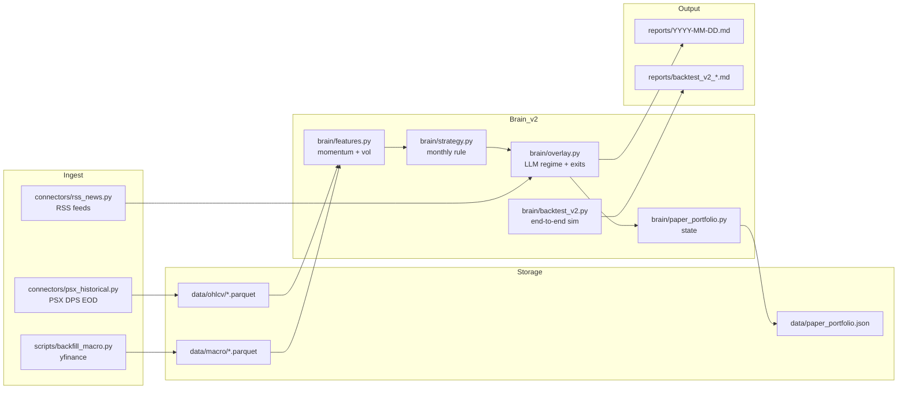

# PSX Trading Bot — Plan D

An evidence-based, low-turnover monthly momentum strategy for the Pakistan Stock
Exchange (PSX), with an LLM-driven defensive overlay for macro regime detection
and emergency exits.

This is **version 2** of the bot. The original ML-heavy design (per-stock
LightGBM + CatBoost + 70-feature daily 5-day direction classifier) was audited
end-to-end and shown to be net-of-cost unprofitable — see
`psx_strategy_v2.md` for the forensic report. The v2 system is deterministic,
rule-based, and simple enough to reason about line-by-line.

It trades a **curated universe of 15 fundamental PSX blue chips**, auto-selected
by `scripts/select_universe.py` from the KSE-30 / KMI-30 pool with sector caps.
The universe has two layers:

- **6 user-required tickers** pinned in `config/candidates.py::REQUIRED_TICKERS`
  — currently `HUBC, PABC, MLCF, OGDC, FABL, PPL`.
- **9 flex slots** ranked by training AUC with sector-diversity caps.
  Regenerate quarterly with `python scripts/select_universe.py`.

## Strategy in one paragraph

On the **last trading day of every month**, rank the 15 stocks by 150-day
log-return, drop the most volatile 30% (by 20-day realized vol), and if the
universe's average 150-day momentum is positive, hold the top 5 equal-weighted
for the month. If universe momentum is negative — **go to cash**. An optional
LLM overlay scales exposure down in CAUTION/CRISIS macro regimes and triggers
emergency exits on severe company-specific news. That's it.

## What it does each trading day

1. Pulls fresh EOD prices (PSX DPS) + macro series (yfinance).
2. Marks open positions to market, updates equity curve.
3. If today is the last trading day of the month → **monthly rebalance**
   (pick top-5, LLM regime multiplier, emit orders).
4. Otherwise → **daily maintenance** (per-position news check, trailing stop
   if enabled, report generation).
5. Writes a Markdown report to `reports/YYYY-MM-DD.md`.

Monthly rebalance is the only time the bot trades. Daily runs are mostly
inspection + paper P&L updates. Expected turnover is ~15-25 trades/year.

## Architecture



## Project layout

```
pakistan stock market/
├── config/
│   ├── universe.py                 # The 15 stocks the bot trades
│   └── candidates.py               # REQUIRED_TICKERS + CANDIDATE_POOL
├── connectors/                     # Data source connectors
│   ├── psx_historical.py           # PSX DPS EOD time-series
│   ├── rss_news.py                 # Dawn, Business Recorder, etc.
│   └── ...
├── data/
│   ├── ohlcv/                      # Per-symbol Parquet (5y daily bars)
│   ├── macro/                      # yfinance macro series
│   └── paper_portfolio.json        # Persistent virtual book
├── brain/
│   ├── features.py                 # Momentum + volatility helpers
│   ├── strategy.py                 # Deterministic monthly momentum rule
│   ├── overlay.py                  # LLM defensive overlay
│   ├── paper_portfolio.py          # Paper-trading portfolio
│   ├── backtest_v2.py              # Honest end-to-end backtest
│   └── _legacy/                    # Archived v1 ML stack (not imported)
├── ui/                             # Streamlit UI (chat + portfolio + scanner)
│   ├── app.py                      # Entry point: streamlit run ui/app.py
│   ├── tools.py                    # Tool-call layer (single source of truth)
│   ├── llm_clients.py              # Claude + Gemini with tool-calling loops
│   ├── portfolio.py                # User portfolio CRUD (JSON-backed)
│   └── recommendations.py          # Position analysis + scanner tables
├── scripts/
│   ├── select_universe.py          # Quarterly: pick the 15 stocks
│   ├── backfill.py                 # Pull 5y OHLCV for universe
│   ├── backfill_macro.py           # Pull 5y macro series
│   ├── generate_report_v2.py       # Daily runner (Plan D)
│   ├── generate_predictions.py     # Daily LLM/rule predictions for the 6 req tickers
│   ├── check_predictions.py        # Scorecard: hit rate vs realised 5d returns
│   ├── daily_pipeline.py           # Top-level orchestrator
│   ├── audit_strategy.py           # Audit: data & calibration
│   ├── audit_baselines.py          # Audit: simple rules w/ costs
│   ├── audit_low_turnover.py       # Audit: monthly/quarterly rules
│   ├── audit_deep.py               # Audit: stability & significance
│   ├── tune_stops.py               # Sweep stop / top_n params
│   └── _legacy/                    # Archived v1 scripts
├── reports/
│   ├── YYYY-MM-DD.md               # Daily runner output
│   └── backtest_v2_*.md            # Backtest runs
├── psx_strategy_v2.md              # Plan D design doc + audit findings
└── README.md                       # This file
```

## Quick start

```powershell
# 1. Install deps
python -m venv .venv
.venv\Scripts\Activate.ps1
pip install -r requirements.txt

# 2. (Optional) Select the 9 flex-slot tickers by training-AUC rank.
#    Only needed if you changed REQUIRED_TICKERS or CANDIDATE_POOL.
python scripts\select_universe.py

# 3. Backfill 5 years of data (one-time, ~1 min)
python scripts\backfill.py
python scripts\backfill_macro.py

# 4. Run the honest backtest (shows the edge this system has)
python -m brain.backtest_v2                       # no LLM overlay
python -m brain.backtest_v2 --with-overlay        # with rule-based overlay

# 5. Generate today's report (safe first run)
python scripts\generate_report_v2.py --dry-run

# 6. Schedule the daily pipeline (see "Scheduling" below)
python scripts\daily_pipeline.py

# 7. Launch the interactive UI (chatbot + portfolio + scanner)
streamlit run ui\app.py

# 8. Generate & track daily predictions for your 6 required tickers
#    (rule-based if no API key; set ANTHROPIC_API_KEY or GOOGLE_API_KEY
#    for the full LLM-with-news version)
python scripts\generate_predictions.py
python scripts\check_predictions.py
```

## Daily predictions + scorecard

`generate_predictions.py` produces a dated 5-trading-day forecast for every
ticker in `REQUIRED_TICKERS` (HUBC, PABC, MLCF, OGDC, FABL, PPL by default).
Each record captures a full data snapshot so the prediction can be honestly
scored later, regardless of model drift. Output:
`data/predictions_log.json` (append-only, keyed by `YYYY-MM-DD-SYMBOL`).

Each prediction contains:

| Field                         | Meaning |
|-------------------------------|---------|
| `direction`                   | BULLISH / NEUTRAL / BEARISH |
| `conviction`                  | LOW / MEDIUM / HIGH |
| `expected_return_5d_*_pct`    | Low / mid / high of the expected range |
| `suggested_action`            | BUY / ADD / HOLD / TRIM / AVOID / SELL |
| `suggested_stop_pkr`          | Level that invalidates the view |
| `suggested_target_pkr`        | Next resistance given the setup |
| `key_drivers` / `key_risks`   | Bullet list grounded in the data |
| `data_snapshot`               | Full numeric state at prediction time (price, 4 momentum horizons, vol regime, RSI, trend, FIPI, policy rate, Brent, USD/PKR, news headlines) |
| `outcome`                     | Filled by `check_predictions.py` after horizon elapses |

`check_predictions.py` walks the log, fills `outcome.actual_return_pct` for
any prediction whose horizon has passed, flags `direction_hit`,
`inside_range`, `stop_triggered`, `target_triggered`, then prints a
scorecard broken down by conviction and by symbol. Run it once a day after
close and the hit rate becomes visible after the first full week.

### Models

| `--model`  | Data used | Quality |
|------------|-----------|---------|
| `rule`     | Momentum (4 horizons), vol, RSI, SMA trend, FIPI, policy rate, Brent for E&P | Fast, deterministic, no news semantics |
| `claude`   | All of the above + news headlines, sector flows, macro narrative | Uses `claude-haiku-4-5`, requires `ANTHROPIC_API_KEY` |
| `gemini`   | Same as Claude | Uses `gemini-2.5-flash`, requires `GOOGLE_API_KEY` |
| `auto`     | Picks Claude > Gemini > rule based on which keys are set | Default |

```powershell
$env:ANTHROPIC_API_KEY = "sk-ant-..."
python scripts\generate_predictions.py         # auto → Claude
python scripts\generate_predictions.py --symbols LUCK MCB   # ad-hoc
python scripts\check_predictions.py             # fills outcomes + prints scorecard
python scripts\check_predictions.py --force     # re-score everything
```

## Overnight global-risk prior (gap-direction model)

Every prediction briefing now opens with an **overnight global risk block**
pulled from `data/macro/overnight_global.parquet` (S&P 500, VIX, Nikkei,
Hang Seng, FTSE, DXY, EM ETF) plus a **data-fitted gap prior**.

The weights in `ui/overnight.py::FITTED_WEIGHTS` come from ridge regression
on 2 years of PSX universe-median overnight gaps (see
`scripts/fit_overnight_weights.py`). Key numbers:

| Signal        | Fitted β | Correlation w/ next-day PSX gap |
|---------------|---------:|---:|
| S&P 500 1d    |  +0.080  | +0.18 |
| EEM (EM) 1d   |  +0.039  | +0.16 |
| Nikkei 1d     |  -0.019  | -0.12 (contrarian) |
| Hang Seng 1d  |  -0.007  | -0.05 (noise) |
| DXY 1d        |  -0.013  | -0.01 |
| VIX dev       |  -0.004  | -0.06 |
| **intercept** |  **+0.34** | — |

**Out-of-sample (Mar-Apr 2026, 33 days):** 51.5% 3-class direction hit vs
27.3% for zero baseline. R² = 0.045. It's a weak tilt, not a forecast.

**Keep the overnight cache fresh:**

```powershell
python scripts\fetch_overnight_global.py   # re-pull 2y; run daily
python scripts\fit_overnight_weights.py    # re-fit when you have ~30 days more data
python scripts\backtest_overnight_prior.py # sanity-check the prior across the window
```

## Daily FIPI cache (build history forward)

`data/flows/fipi_daily.parquet` stores daily SCStrade FIPI snapshots so we
can eventually fit FIPI into the overnight model. SCStrade has no historical
archive and NCCPL blocks scrapers, so this cache **grows forward** one row
per run.

```powershell
python scripts\cache_fipi_daily.py    # append today (run after ~16:00 PKT)
```

Recommended: schedule with Task Scheduler to run `cache_fipi_daily.py`
every weekday around 16:30 PKT. Once you have ≥30 days of history, re-run
`fit_overnight_weights.py` with FIPI added as a feature and the prior
should tighten further.


## Transaction cost model

`config/costs.py` models PSX round-trip costs so every trade plan is
scored on NET returns (not gross):

  Brokerage 0.30% + CDC/PSX/SECP 0.013% + FED 0.048% + slippage 0.20%
  = ~0.56% round-trip, plus 15% CGT on gains (filer, <1y hold)

A BUY/ADD call must clear `cost + 1.0%` minimum edge (≈1.6% gross) or
it falls into the *"LLM-BUY-BUT-SUB-EDGE"* bucket in
`scripts/todays_buys.py` and is skipped. The live prompt in
`generate_predictions.py` also tells Claude to downgrade to HOLD when
expected 5d mid < 1.6%. The scorecard (`check_predictions.py`) now
reports both gross and NET direction hit rate + average return.

```powershell
python config\costs.py          # show the model
python scripts\todays_buys.py   # see gross / cost / net columns
```


## Scored news sentiment

`scripts/score_news_sentiment.py` batches RSS headlines through Claude
Haiku and scores each one for PSX impact (sentiment in [-1, +1],
confidence, category, affected tickers). Writes to
`data/news/scored_news.parquet`, dedup by hashed article link.

```powershell
python scripts\score_news_sentiment.py                # default: 5/feed, batch 8
python scripts\score_news_sentiment.py --per-feed 10  # pull more per feed
python scripts\score_news_sentiment.py --rescore      # re-score everything
```

`ui/news_sentiment.py` aggregates the cache into:
- `macro_sentiment(hours)` — weighted macro/policy tilt
- `ticker_sentiment(sym, hours)` — per-symbol tilt
- `sentiment_block(...)` — plain-text block for LLM briefings

The macro tilt is automatically embedded in `build_overnight_block(...)`
(so walk-forward + live predictions both see it), and the full scored
block (including ticker-specific tilt) is appended to every per-symbol
prediction briefing in `generate_predictions.py`.

Recommended: schedule alongside `cache_fipi_daily.py` — run
`score_news_sentiment.py` 2-3x per day (morning, midday, close) to keep
the 24h macro tilt fresh.


## Deployment — GitHub Actions as your data janitor, Streamlit on your laptop

The daily data pipeline runs as **four scheduled GitHub Actions workflows**
that fetch, score, and commit updated data back to the repo. Your local
Streamlit UI just runs `git pull` (or clicks the sidebar button) to see
the latest data. No servers to manage, no cloud UI hosting, no port
forwarding.

### Schedule (all times UTC; cron is `m h DOM MON DOW`, DOW 1-5 = Mon-Fri)

| Workflow | Cron | PKT time | What it does |
|----------|------|----------|--------------|
| `overnight.yml`      | `0 4 * * 1-5` | 09:00 Mon-Fri | Refresh S&P 500, VIX, Nikkei, HSI, FTSE, DXY, EEM closes from yfinance → `data/macro/overnight_global.parquet` |
| `predictions.yml`    | `15 4 * * 1-5` | 09:15 Mon-Fri | Generate 5-day predictions for all 15 universe stocks with Claude → `data/predictions_log.json` |
| `eod.yml`            | `30 11 * * 1-5` | 16:30 Mon-Fri | Append today's FIPI flow snapshot + score yesterday's predictions |
| `news_scoring.yml`   | `0 2,8,13 * * 1-5` | 07:00 / 13:00 / 18:00 | Batch-score fresh RSS headlines with Claude Haiku → `data/news/scored_news.parquet` |

### One-time setup (~10 minutes)

1. **Push this repo to GitHub** (private is strongly recommended — the
   strategy code and your trading picks are in here):

   ```powershell
   git init
   git add .
   git commit -m "init"
   git remote add origin https://github.com/<you>/psx-trading-bot.git
   git push -u origin main
   ```

2. **Add repo secrets** at *Settings → Secrets and variables → Actions*:
   - `ANTHROPIC_API_KEY` — required for predictions + news scoring
   - `GEMINI_API_KEY` — optional, only if you use the Gemini chat fallback
     in the local UI

3. **Enable Actions** at *Settings → Actions → General*:
   - Allow all actions
   - Under *Workflow permissions*, select **"Read and write permissions"**
     (so the jobs can commit data back). Also tick **"Allow GitHub Actions
     to create and approve pull requests"** just in case.

4. **Verify the first run** — go to the *Actions* tab, pick any workflow,
   click **"Run workflow"** to trigger it manually. Confirm it succeeds
   and that a commit like `data: overnight globals 2026-04-24` appears
   on main.

### Daily usage on your laptop

```powershell
# 1. Clone once
git clone https://github.com/<you>/psx-trading-bot.git
cd psx-trading-bot
python -m venv .venv
.venv\Scripts\activate
pip install -r requirements.txt

# 2. Create a local .env with your API keys (never commit this)
#    ANTHROPIC_API_KEY=...
#    GEMINI_API_KEY=...

# 3. Launch the UI
streamlit run ui\app.py
```

Then in the running Streamlit app, click **"Pull latest data from GitHub"**
in the sidebar whenever you want a fresh snapshot — or just `git pull`
manually and restart. The button runs `git pull --ff-only` and clears the
price cache so new data is visible immediately.

### What commits look like in your history

After a couple of trading days:

```
git log --oneline -n 10
  a1b2c3d data: news sentiment 2026-04-24T1300Z
  e4f5g6h data: EOD flows + scorecard 2026-04-24
  i7j8k9l data: predictions 2026-04-24
  m0n1o2p data: overnight globals 2026-04-24
  ...
```

Every prediction, every scored headline, every FIPI row is a git commit —
that's your permanent audit trail.

### Cost

- GitHub Actions: ~5 min per run × 8 runs/day × 22 trading days ≈ **880
  minutes/month**. Free tier gives 2,000 min/month for private repos, so
  this uses about 44% of your free quota. Public repos: unlimited.
- Anthropic: about **$0.05–0.15/day** at current Haiku pricing for news
  scoring (3x/day, ~25 articles each) + predictions (1x/day, 15 stocks).
- Hosting: **$0** — the UI runs locally.


## Interactive UI (chat + portfolio + scanner)

The UI is a Streamlit app that pairs a Claude-Haiku or Gemini-Flash chatbot
with the Plan D backend. Launch with:

```powershell
streamlit run ui\app.py
```

Then open http://localhost:8501 in your browser.

### Four tabs

- **Chat** — ask anything about your positions, today's picks, or the market.
  Example prompts:
  - *"I bought MCB at 380 on 2026-03-15, 100 shares. Should I hold?"*
  - *"What are today's top 5 buy candidates and why?"*
  - *"Look at my whole portfolio and tell me which names to trim first."*

  The bot has tool access to live prices, momentum ranks, the Phase 1 signal,
  the market regime, your portfolio, and historical bars. It **cannot** make
  up numbers — every answer cites real data pulled from our engine.

- **Portfolio** — enter real holdings (symbol, entry price, qty, date). The
  app shows live P&L, suggested 12% trailing stops, and a HOLD / SELL / TRIM
  recommendation per position derived from the Phase 1 rule. Your portfolio
  lives in `data/user_portfolio.json`, **separate** from the bot's own paper
  portfolio.

- **Scanner** — full 15-stock universe ranked by 150d momentum, with today's
  Phase 1 picks highlighted. Good for hunting fresh buy ideas.

- **Backtest** — run the full Plan D Phase 1 backtest on demand and view the
  equity curve against buy-and-hold.

### API keys

Either set them before launch:

```powershell
$env:ANTHROPIC_API_KEY = "sk-ant-..."
$env:GOOGLE_API_KEY    = "AIza..."           # for Gemini
```

Or paste them into the sidebar at runtime (stored in session only, never
written to disk). You only need one — pick the provider you prefer from the
sidebar radio.

### Safety

- The chatbot is **advisory only**. It cannot add, edit, or delete positions.
  All portfolio mutations happen through explicit UI buttons.
- Recommendations are grounded in the Phase 1 mechanical rule. If the rule
  says CASH, the bot will tell you — it won't invent a bullish case.

## Configuring the LLM overlay

The LLM overlay is **optional**. Without an API key the pipeline uses a
transparent rule-based fallback (KSE-100 drawdown → CAUTION / CRISIS classes,
keyword scan for emergency exits).

To enable Claude (recommended, <$0.50/month at monthly frequency):

```powershell
$env:ANTHROPIC_API_KEY = "sk-ant-..."
python scripts\generate_report_v2.py
```

To permanently set it:

```powershell
[System.Environment]::SetEnvironmentVariable("ANTHROPIC_API_KEY", "sk-ant-...", "User")
```

The LLM is **only** used for:
1. Classifying the current macro regime (NORMAL / CAUTION / CRISIS) to scale
   portfolio exposure (1.0× / 0.75× / 0.5×).
2. Detecting severe negative catalysts on open positions (emergency exit).

It does **not** generate buy signals. Entry is mechanical.

## Backtest headline

`python -m brain.backtest_v2` — `reports/backtest_v2_core.md`

```
Period: 2021-04-26 → 2026-04-23 (4.90 years)

                     Strategy   Buy & Hold   Delta
CAGR                 +18.18%    +19.54%      -1.36%
Sharpe               0.92       0.88         +0.04
Sortino              0.96       —
Calmar               0.85       —
Max drawdown         -21.4%     -32.3%       +10.8pp
% 1Y windows > B&H   35.2%

Total closed trades  45
Win rate             62.2%
Avg return/trade     +10.9%
Avg hold             73.6 days
Profit factor        4.62
```

Cost sensitivity (Sharpe collapses gracefully, not catastrophically):

| Round-trip | CAGR | Sharpe | Max DD |
|---:|---:|---:|---:|
| 20 bps | +18.6% | 0.94 | -21.4% |
| 40 bps | +18.2% | 0.92 | -21.4% |
| 60 bps | +17.7% | 0.91 | -21.5% |
| 80 bps | +17.3% | 0.89 | -21.7% |
| 100 bps | +16.9% | 0.87 | -21.9% |

We are **deliberately** flat for the 2021-22 period (universe momentum
negative → 100% cash), which is why the rule "misses" early PSX returns.
That's the same mechanism that cut the 2025-26 drawdown from -32% to -21%.

See `psx_strategy_v2.md` for the full audit trail (autocorrelated targets,
miscalibrated probabilities, transaction-cost math, monte-carlo significance
test, regime stability).

## Interpreting the daily report

`reports/YYYY-MM-DD.md` contains:

- **Header**: date, cash, open positions, total equity, benchmark equity.
- **Macro regime**: current classification and exposure multiplier.
- **Open positions table**: symbol, entry date, entry price, current price,
  unrealized P&L, peak from entry, days held.
- **Today's actions**:
  - Monthly rebalance day → picks table (top-5 from rule), orders executed.
  - Any trading day → stop checks, emergency exits from overlay.
- **Equity curve**: 30-day equity history for quick eyeballing.

## Tuning levers

In `brain/strategy.py::StrategyConfig`:

- `top_n` — number of names to hold (default 5). Lower = more concentrated.
- `momentum_window` — 150 days was best across the sweep; don't go below 60.
- `vol_rank_cap` — keep names in the bottom 70% of 20d vol. Tighter = calmer.
- `market_filter_on` — the universe-momentum gate. Turning this off raises
  CAGR ~2% at the cost of ~10 percentage points more max drawdown.
- `use_trailing_stop` — **off by default**. `tune_stops.py` showed stops
  degrade Sharpe/Calmar in this monthly rebalancing context; they fire on
  normal volatility and force re-entry at the same price after costs.
- `exposure_normal` / `exposure_caution` / `exposure_crisis` — multipliers
  applied to the target weight from the LLM regime classification.

## Scheduling (Windows Task Scheduler)

Run once, after PSX close + DPS publishes EOD (≈ 6:00 PM PKT, Mon-Fri):

```powershell
$action = New-ScheduledTaskAction -Execute "powershell.exe" `
    -Argument "-WindowStyle Hidden -Command `"cd 'C:\Users\it\Downloads\pakistan stock market'; .\.venv\Scripts\python.exe scripts\daily_pipeline.py`""
$trigger = New-ScheduledTaskTrigger -Daily -At 6:00PM
$settings = New-ScheduledTaskSettingsSet -StartWhenAvailable -DontStopIfGoingOnBatteries
Register-ScheduledTask -TaskName "PSX Trading Bot" -Action $action -Trigger $trigger -Settings $settings
```

Linux/macOS cron:

```cron
0 18 * * 1-5  cd /path/to/project && ./.venv/bin/python scripts/daily_pipeline.py >> logs/pipeline.log 2>&1
```

## Daily pipeline options

```powershell
python scripts\daily_pipeline.py                 # full run
python scripts\daily_pipeline.py --skip-macro    # skip yfinance refresh
python scripts\daily_pipeline.py --skip-ohlcv    # use cached PSX data
python scripts\daily_pipeline.py --no-llm        # rule-based overlay only
python scripts\daily_pipeline.py --dry-run       # don't touch paper portfolio
```

## Realistic expectations

Over a 3-5 year horizon on our 15-stock universe with 40 bps round-trip costs:

- **CAGR: 15-20%** (not 30%+ — those numbers came from a cherry-picked window)
- **Sharpe: 0.9 - 1.1**
- **Max drawdown: -15% to -22%** (vs buy-and-hold -32%)
- **Win rate: 60-65%** on closed trades
- **~15-25 trades/year** total

**The rule underperforms buy-and-hold in strong bull years** (e.g. 2023: rule
+16% vs B&H +47%). The 150-day market filter takes time to flip back on after
a drawdown. That is the *price* of drawdown protection, and it is what keeps
capital intact through the 2022 PKR crisis and 2025-26 drawdown.

## Important limitations

1. **Paper trading only.** PSX does not offer retail execution APIs. Real
   execution requires manual order entry in a broker app (MCB, AKD, Topline,
   JS, etc.).
2. **Close-based signals only.** PSX DPS publishes only open/close/volume — no
   reliable high/low. Stops are close-referenced.
3. **English-only news.** Urdu commentary from retail forums is not captured.
4. **LLM is advisory.** The rule-based fallback must produce a coherent decision
   by itself; LLM only enriches it.
5. **This is not investment advice.** Equity trading can result in total loss.

## Design principles

1. **Evidence before cleverness.** Every change is backed by an audit script
   we can re-run on live data.
2. **Costs first.** Transaction costs are modelled into every number; a rule
   that needs 0-cost to work doesn't ship.
3. **Mechanical core, advisory overlay.** The LLM never generates buy signals.
   It only scales risk down or pulls the ripcord on a specific position.
4. **Fail-safe defaults.** No API key? Rule fallback. No news? Neutral. No
   macro data? Cached. The bot never silently breaks.
5. **Re-audit quarterly.** `scripts/audit_deep.py` runs a monkey-test against
   random portfolios. If the real rule stops beating 90% of monkeys, we stop
   trading it.
